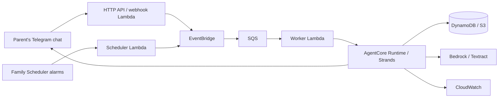

# Repaso

Repaso turns a fourth-grade math sheet into a daily practice routine in a parent's Telegram chat. It prepares practice, follows responses, changes the next session and asks the adult for a decision when an answer is uncertain or difficulty persists.

**Current evidence:** the complete journey is reproducible with synthetic data. Its day-one model outputs are replayed from a recording of the model fleet made against Amazon Bedrock on September 12, 2026, and priced from what the provider reported; the days after it are still authored. A separate, actual Amazon Textract call recognized a new printed Spanish fractions page on September 6, 2026, and on September 12 every configured Bedrock model answered and filled its schema in 27 of 27 bounded probe calls. A replay is not a live run. No measured learning benefit, family pilot or deployed cloud journey is claimed. See the [evidence register](docs/evidence/README.md).

**Evaluating this?** [docs/submission/judging.md](docs/submission/judging.md) is a five-minute path that needs no account, no keys and no deployment.

## Try the complete journey

Python 3.12 or newer; no AWS account or Telegram token required for this demo.

```bash
python3 -m venv .venv
source .venv/bin/activate
pip install -c requirements.lock -e ".[dev]"
python scripts/run_judge_demo.py
```

Open **http://127.0.0.1:8766/judge/** and enter **REPASO-DEMO**. Run the journey, then move through seven stages: the material, scheduled delivery, an uncertain answer, adult review, persistent difficulty, the adult's choice and the next practice. Compare **a note for the teacher** with **less practice tomorrow**. Both choices have a visible consequence. The clock and data are isolated from any pilot family. English navigation accompanies a Spanish family conversation; the technical details and JSON export are secondary.

For a terminal run, choose an empty output directory:

```bash
python scripts/run_demo_scenario.py --data-dir .local_data/demo-note --decision teacher_note --report .local_data/demo-note.json
python scripts/run_demo_scenario.py --data-dir .local_data/demo-light --decision reduce_load --report .local_data/demo-light.json
```

These are executions of the actual orchestration against a recorded cassette, with local storage and local delivery. Advancing four labeled school days takes seconds. The tokens and dollars the run prints are what that one recording measured; they do not price the authored days that follow it, or any infrastructure.

## What it costs

One student's day of practice cost **$0.1629** in model calls: 29 live Amazon Bedrock calls on September 12, 2026, in `us-east-1`, every token read from the provider's own usage metadata. The journey behind that number ran end to end against live inference — enrolment, two photographed pages ingested, an item bank generated and reviewed, one capsule of three questions delivered, three answers graded, one answer quarantined and released by the parent. Building the item bank from the two pages was $0.1516 of it; the day's practice itself was $0.0111.

Twenty school days for one student comes to between $0.37 and $3.26, and thirty families to between $11.21 and $97.73 a month, depending entirely on how often a new page is photographed. Those two figures are **arithmetic on that one measured journey, not an observed cost**: no family has run a second day and no invoice has been read. Both exclude infrastructure, storage, delivery, text extraction and human time. The full profile — every schema against every model, the latency percentiles, what each role does when a call fails, and the routing decisions that followed — is in [the model profile](docs/evidence/model-profile-2026-09-12.md).

## What the family can do

The current pilot scope is one child per family, fourth-grade math, a clear printed Spanish PNG/JPEG or an unencrypted one-page PDF, at most 10 MB. Voice notes, Spanish handwriting, other subjects and broader grade coverage are outside this release. The bundled taxonomy contains neighboring grades for development, but enrollment exposes fourth grade.

- Enroll with an invitation, choose an alias, class section and practice time. A family alarm is created at that time, in the pilot's single configured timezone, which enrollment does not ask for and no command changes; pause, resume, schedule changes and deletion update that alarm.
- Submit material. Legibility and supported-format checks precede OCR; content and generated items are reviewed before activation. Items derived from one family's sheet stay scoped to that family.
- Receive practice at the agreed time. A session is marked delivered after the transport acknowledges it. Unacknowledged messages remain recoverable.
- Answer and receive feedback. Rules update mastery and spaced review. Persistent difficulty, fast guessing and adult choices can change difficulty, require an explanation or reduce the next workload for a limited time.
- Review an uncertain answer with the question, answer, key and rubric in the same message. Correct and incorrect decisions both create a final human assessment. “I don't know yet” leaves it pending.
- Choose a drafted teacher note or reduced practice after persistent difficulty. The note goes to the parent to review and forward; Repaso does not message the teacher automatically.
- Use `/pause`, `/resume`, `/schedule` and `/forget`. Deletion removes active family state, material versions, grades and alarms. Existing Telegram messages are managed by Telegram; operational logs have seven-day configured retention and managed backups can retain prior data for up to 35 days.

## Architecture



Four Strands graphs cover ingestion, session planning, response handling and daily quality review. Model roles classify, generate, judge, map and probe; deterministic code controls learning updates, ownership, deadlines, budgets and decisions with external effects. The production worker resolves the AgentCore ARN through SSM and invokes the remote runtime. Cost and blast-radius controls are listed, with where each is enforced, in [the controls page](docs/operations/controls.md). Lambda dependencies and the AgentCore runtime are packaged as Linux ARM64 images. The diagram describes the implemented deployment path; the [deployment checklist](deploy/README.md) records the remaining cloud acceptance work.

Durable operation records, leases and a pending-message outbox support retries. Tested duplicate events do not double-apply grades or learning updates. Telegram does not provide an idempotency key for sends: if it accepts a message and its acknowledgment is lost, a retry can duplicate that message. This is an at-least-once delivery design, not a universal exactly-once claim.

## Verify

```bash
REPASO_LOCAL_MODE=true pytest -q
ruff check .
python scripts/run_demo_clock.py --days 14 --seed 20260901 --data-dir .local_data/clock-new
python scripts/run_answer_evaluation.py
```

The full suite includes ten complete transport simulations through webhook, EventBridge, SQS, worker, AgentCore adapter, runtime, DynamoDB, S3, Scheduler and Telegram adapter. AWS services are emulated by Moto; the AgentCore HTTP boundary and Telegram network are substituted. Alternate runs inject failures and replay events. Those runs prove integration behavior under those substitutions, not ten successful deployments.

The 60-answer evaluation set has proposed synthetic examples and a separate blind teacher-review file. Its independent labels are deliberately blank. Validation cannot award model-quality scores without independent review and real predictions. [Evaluation protocol](evaluation/README.md) · [Pilot kit](docs/pilot/README.md).

Live checks are opt-in and incur AWS charges. Use only the authorized `quanta` account and region. [Live conformance](tests/live/README.md) · [Deployment](deploy/README.md) · [Product details](docs/product/product-overview.md) · [Submission materials](docs/submission/README.md).

This system stores a record about a child and sends material a stranger could have influenced to a model. What that record holds, how it is encrypted, what erasure reaches, how prompt injection is screened in both directions, and which assurances only a deployment can give, are written down in the [security posture](docs/security/README.md).

## Evidence and limits

Every claim in the submission should point to the [current evidence register](docs/evidence/README.md). Historical August seed sweeps describe their own simulator versions and assumptions; they are not current product accuracy or family-impact measurements. Self-reported model confidence is not a calibrated probability. The options-only answerability probe is advisory; guessing a correct choice does not veto an otherwise valid math exercise. A shared section signal is experimental and does not establish formal anonymity.

The recommended hackathon category is **Everyday Agents**: the main user is the parent maintaining a family routine. The difference to demonstrate is completed work between messages—scheduling, adaptation and an informed adult decision—not the number of agents.

MIT licensed. Dependencies and reusable components are declared in `pyproject.toml`, `requirements.lock` and the [submission provenance checklist](docs/submission/provenance.md). Public release, hosted availability, final video links, Builder ID and article publication remain explicit release steps.
