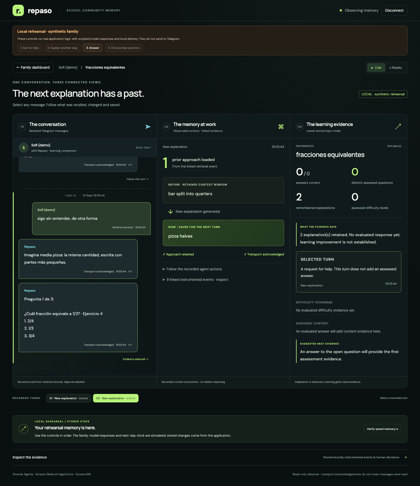
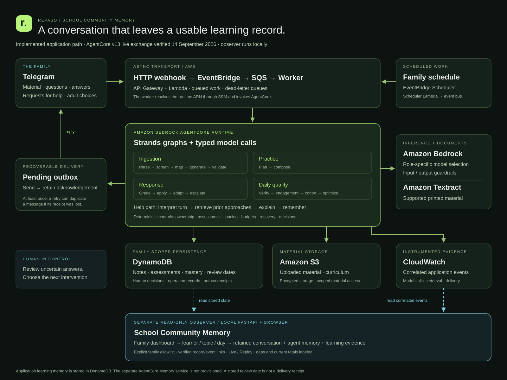

# Repaso — School Community Memory

**A learner should not have to start from zero every time they ask for help.**

Repaso connects a family's Telegram conversation to a persistent learning record: what the learner tried, which explanation the agent used, what an answer demonstrated, and what should happen next. A family dashboard makes that continuity visible to the adult supporting them.

Built for the **Good Neighbor Agents** track with the **Strands Agents SDK** and **Amazon Bedrock AgentCore Runtime**. The proposed audience is a community learning facilitator supporting families between meetings, starting with fourth-grade mathematics.

**Contributing back to Strands:** this project led to two upstream bug-fix pull requests: [model ID telemetry through the public model configuration API](https://github.com/strands-agents/harness-sdk/pull/4207) and [custom model streaming signatures aligned with runtime arguments](https://github.com/strands-agents/harness-sdk/pull/4208). Both include regression tests; both were **open, not merged**, when verified on September 14, 2026. [Contribution evidence](docs/submission/upstream-contributions.md).

[Try it locally](#try-it-locally) · [Five-minute judging guide](docs/submission/judging.md) · [Architecture](#architecture) · [Live evidence](docs/submission/memory-live-check-2026-09-14.md) · [Deployment](deploy/README.md) · [MIT license](LICENSE)

## See the memory at work


*Verified local rehearsal screenshot. The family, model replies and advanced clock are synthetic; this image is not evidence of a school deployment or a learning gain.*

The dashboard moves from **family → learner → topic → recorded day → learning episode**. An episode opens three synchronized columns:

| Conversation | Agent and memory | Learning evidence |
| --- | --- | --- |
| Retained learner excerpts and linked agent replies | Previous context retrieved, new approach saved, model and delivery events | Evaluated answers, distinct question content, difficulty coverage and stored mastery estimate |

Select a message to follow the same turn across all three. Replay explores recorded turns; Live observes new stored evidence. Current topic totals remain labeled as current during replay. The dashboard also shows daily and cumulative evidence, stored spaced-review dates and recorded adult decisions.



*Verified synthetic rehearsal: two explanation approaches, zero assessed answers. The comparison shows application memory, not hidden model reasoning.*

## What is working

**A real Telegram exchange was verified against AWS on September 14, 2026, using AgentCore runtime version 13.** The learner asked for another example of equivalent fractions. Repaso retrieved its previous cake approach, produced a paper-folding explanation and saved that new approach. Correlated AWS events linked retrieval, generation, saved memory and delivery. Both successful help requests left the assessed-answer count at three.

Those three earlier assessments repeated the same question content. The interface shows **three answers, one distinct question**, rather than presenting that result as proven mastery. There is currently one day of real activity, not a measured improvement curve. The [dated live record](docs/submission/memory-live-check-2026-09-14.md) includes failures, fixes and the exact evidence boundaries.

| Demonstration | What it establishes |
| --- | --- |
| Live Telegram + AWS observer | A request retrieves prior context, receives another explanation and leaves new memory; help is not graded as an answer |
| Local memory rehearsal | Repeatable help → another approach → assessed answer → adult decision → reduced next practice |
| Offline judge journey | Material ingestion, scheduled practice, uncertain-answer review and both adult decisions, using recorded/authored model outputs |
| Automated tests | Application behavior, recovery and isolation under their stated test substitutions |

Neither the developer-operated Telegram trial nor the synthetic demonstrations are a family pilot, teacher evaluation or measurement of educational impact.

## Try it locally

Use **Python 3.12 or newer**. The local demonstrations need no AWS account, Telegram token, Docker or paid inference.

```bash
git clone https://github.com/CarSanoja/repaso.git
cd repaso
python3.12 -m venv .venv
source .venv/bin/activate
pip install -c requirements.lock -e ".[dev]"
python scripts/run_memory_observer.py --rehearsal --port 8870
```

Open **http://127.0.0.1:8870/judge/memory/** and enter **`REPASO-VIEW`**.

1. Press **Ask for help**, then open the fractions topic's learning episode.
2. Press **Explain another way**. The chat and memory comparison follow the new turn; the previous approach is visible beside the newly saved approach.
3. Press **Answer**. An assessed answer appears in the learning record.
4. Press **Choose less practice**. Inspect the saved decision and next scheduled practice under **Inspect the evidence → Decisions / Practice**.
5. Return to **Family dashboard**. Select a learner, topic and day; open the day's episode and explore Replay. **Verify saved memory** performs another read from storage.

The rehearsal uses real application orchestration with scripted model replies, local delivery and an explicitly advanced clock. Its state lives in a temporary directory and resets when the process stops. It sends nothing to Telegram.

For the separate, seven-stage judge journey:

```bash
python scripts/run_judge_demo.py
```

Open **http://127.0.0.1:8766/judge/**, code **`REPASO-DEMO`**. Compare **a note for the teacher** with **less practice tomorrow**. Day one replays a recorded Bedrock cassette; later days are authored. See the [judging guide](docs/submission/judging.md) for the full route and terminal commands.

## Observe your AWS deployment

The observer is read-only and requires an explicit family allowlist and credentials able to read the deployment's state and logs:

```bash
python scripts/run_memory_observer.py \
  --profile YOUR_AWS_PROFILE \
  --region us-east-1 \
  --family-id YOUR_AUTHORIZED_FAMILY_ID \
  --port 8767
```

Open **http://127.0.0.1:8767/judge/memory/**, code **`REPASO-VIEW`** by default. `--code` overrides it. The server binds to loopback; this is not a publicly hosted judge URL. You operate Telegram separately. The observer uses local send/publish adapters and cannot send Telegram messages or enqueue work.

`--history-minutes 1440` is the default initial log lookback. Retained state can remain visible when matching logs have expired or are unavailable; missing links are labeled rather than inferred from timestamps.

For provisioning, prerequisites, secrets, CDK stacks and acceptance checks, use [the deployment runbook](deploy/README.md), [AgentCore runtime guide](deploy/agentcore/README.md) and [infrastructure guide](infra/README.md). Live inference and deployed infrastructure incur AWS charges. Configure your own authorized account and project secrets; no credentials are bundled.

## Architecture



[PNG version](docs/media/architecture.png) · [Diagram notes](docs/media/README.md)

Telegram updates enter the HTTP API, then pass through EventBridge, SQS and a worker that invokes AgentCore Runtime. Scheduler events enter the same work pipeline. The runtime uses Strands for typed model calls and graph orchestration, DynamoDB for learning and operational state, S3 for material, Bedrock for inference and Textract for supported OCR. A recoverable outbox sends replies back to Telegram.

The observer reads DynamoDB state and correlated CloudWatch events. This application implements its own learning memory; it does **not** provision the separate AgentCore Memory service. Its dashboard is currently a local observer of the deployed runtime, not a school administration platform.

### Where Strands does the work

| Implementation | Responsibility |
| --- | --- |
| [Ingestion graph](src/repaso/core/orchestration/ingest_graph.py) | Parse → screen → map → generate → validate supported learning material |
| [Practice graph](src/repaso/core/orchestration/tutor_graph.py) | Plan → compose a practice capsule |
| [Response graph](src/repaso/core/orchestration/response_graph.py) | Grade → apply → adapt → escalate when required |
| [Quality graph](src/repaso/core/orchestration/quality_graph.py) | Verify → engagement → cohort → optimize |
| [Structured model boundary](src/repaso/agents/base.py) | Strands structured output validated into typed schemas, with explicit failure behavior |
| [Conversational help](src/repaso/core/orchestration/study_help.py) and [explainer](src/repaso/agents/explainer.py) | Read the turn, retrieve retained approaches and produce an explanation with the current context |
| [Learning projection](src/repaso/api/memory_learning.py), [episodes](src/repaso/api/memory_episodes.py), [evolution](src/repaso/api/memory_evolution.py) | Turn stored assessments and correlated events into inspectable evidence |

Deterministic code controls family ownership, assessments, spacing, mastery updates, time limits and decisions with external effects. Durable operation records and leases prevent tested duplicate events from double-applying learning effects. Delivery is at least once: Telegram can duplicate a message if it accepts a send and its acknowledgement is lost.

## Verify the implementation

```bash
REPASO_LOCAL_MODE=true pytest -q
ruff check .
node --check src/repaso/api/static/memory.js
python scripts/check_repo_hygiene.py
```

Node is needed only for the JavaScript syntax check. Install `.[dev,deploy,runtime]` instead of `.[dev]` to include infrastructure and runtime dependencies. Optional live tests require explicit configuration and a budget; see [tests/live](tests/live/README.md). The [episode runbook](docs/submission/episode-demo-runbook.md) records browser checks at 1440, 900 and 390 px and dated AWS verification. The [evidence register](docs/evidence/README.md) distinguishes live calls, recorded replay and synthetic transport tests.

A measured September 12 synthetic journey used **$0.1629 in Bedrock model calls**. That is one run, not a production price; it excludes infrastructure, storage, delivery, OCR and human time. See [the measured model profile](docs/evidence/model-profile-2026-09-12.md) for denominators and limitations.

## Scope and responsible use

- The supported enrollment path is one learner per family, fourth-grade mathematics, with clear printed Spanish PNG/JPEG or unencrypted one-page PDF material up to 10 MB. The observer can separate multiple stored learner records; this does not expand enrollment support.
- Voice notes, handwriting and other subjects are outside this release. The workflow requires connectivity and an adult contact.
- Family-owned material stays scoped to that family. The observer exposes only explicitly allowlisted families. See [security and retention](docs/security/README.md).
- A teacher note is drafted for the adult to review and forward. Repaso does not automatically contact a teacher. Stored review dates are not delivery guarantees.
- Held assessments are excluded from topic correctness totals. Help history is retention-limited. Mastery is a stored application estimate, not a validated learning outcome.
- There is no claimed school partnership, independent teacher grading evaluation or measured benefit to families. The community-facilitator use case is the proposed audience; roster integration and school administration remain outside the demonstrated product.

## Documentation and license

[Submission materials](docs/submission/README.md) · [Project description](docs/submission/project-description.md) · [Demo runbook](docs/submission/episode-demo-runbook.md) · [Research and audience](docs/submission/pitch-research.md) · [Script catalog](scripts/README.md) · [Evaluation protocol](evaluation/README.md) · [Release checklist](docs/submission/release-checklist.md)

Repaso is **MIT licensed**. Dependency versions and provenance are in [pyproject.toml](pyproject.toml), [requirements.lock](requirements.lock) and the [provenance checklist](docs/submission/provenance.md). Hosted access, public video and submission status are tracked in the release checklist; a loopback address is never a public demo link.
