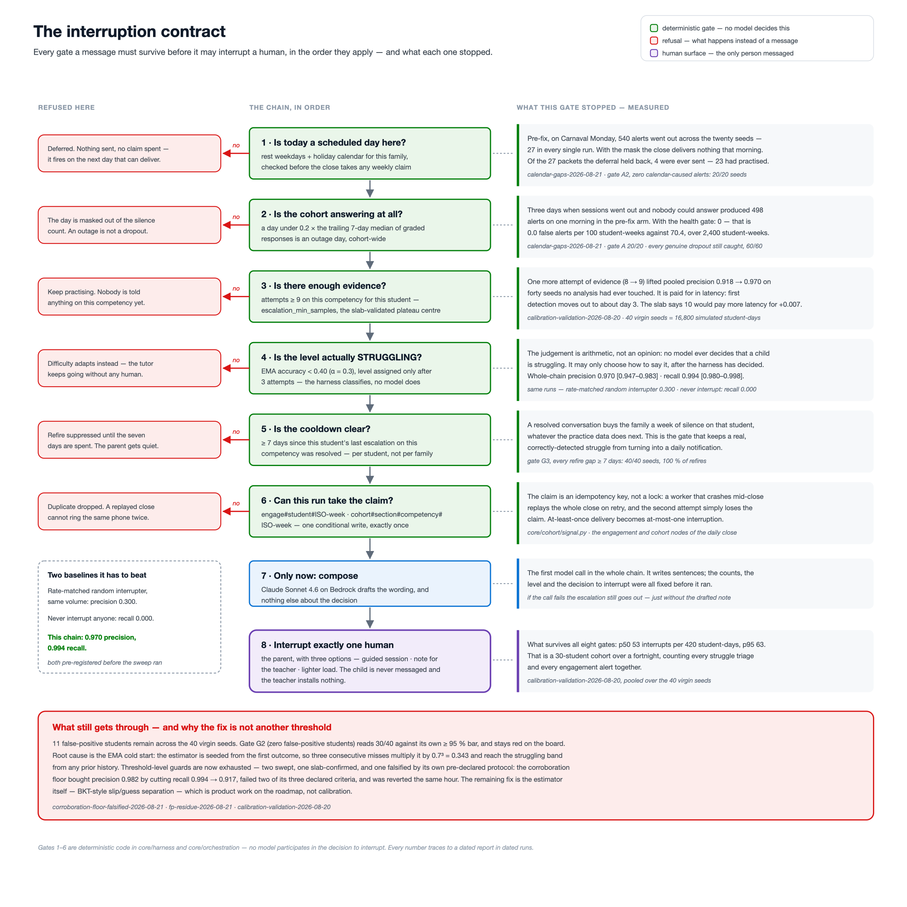
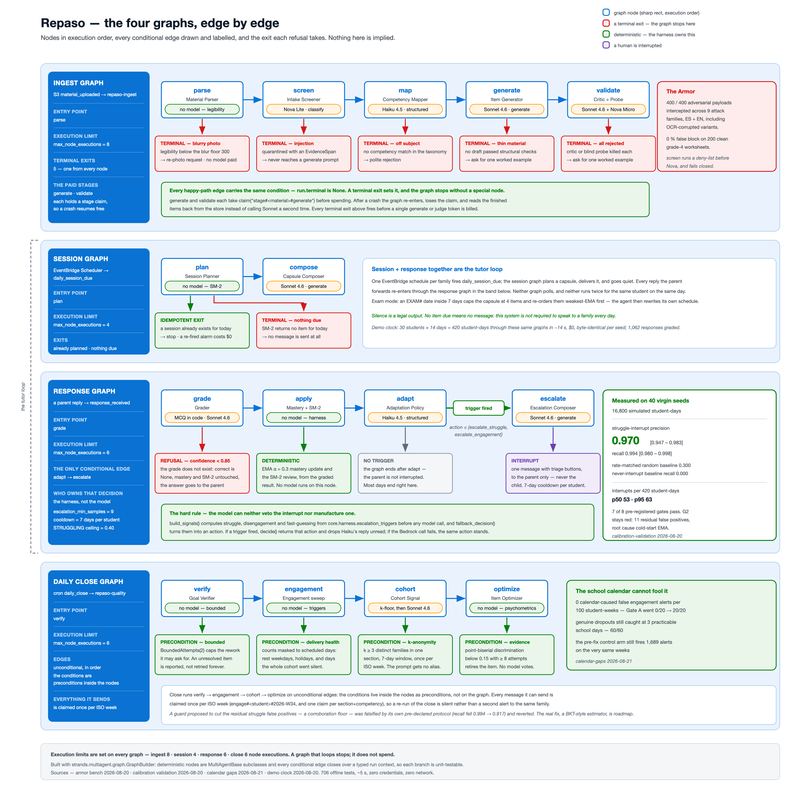
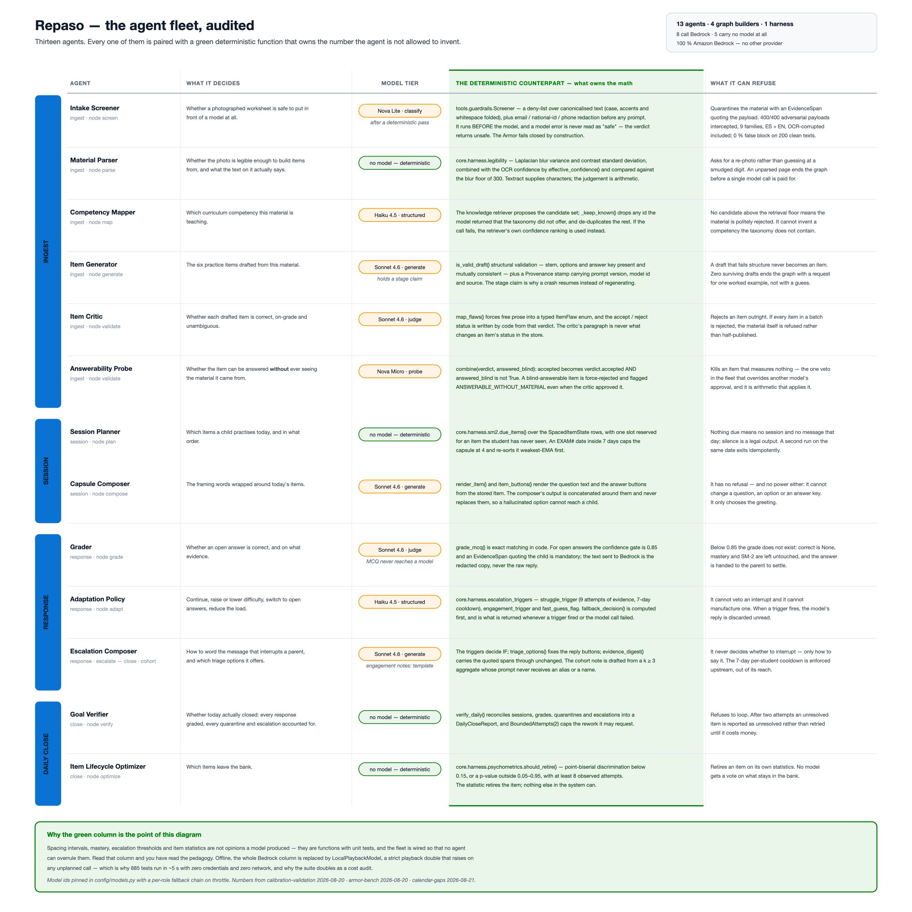
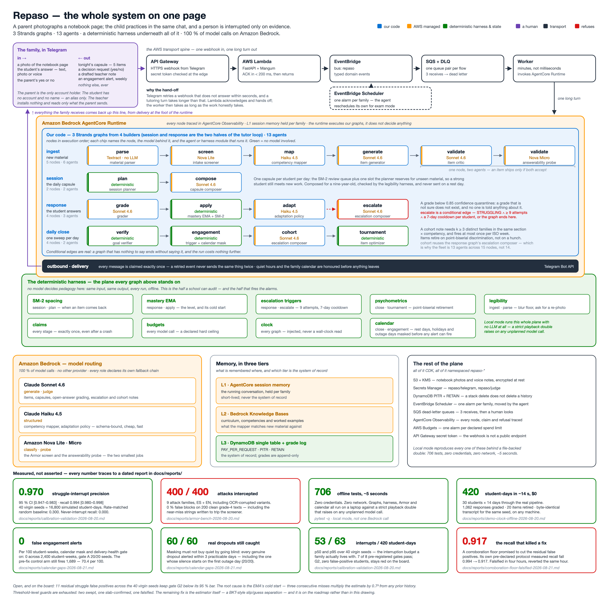
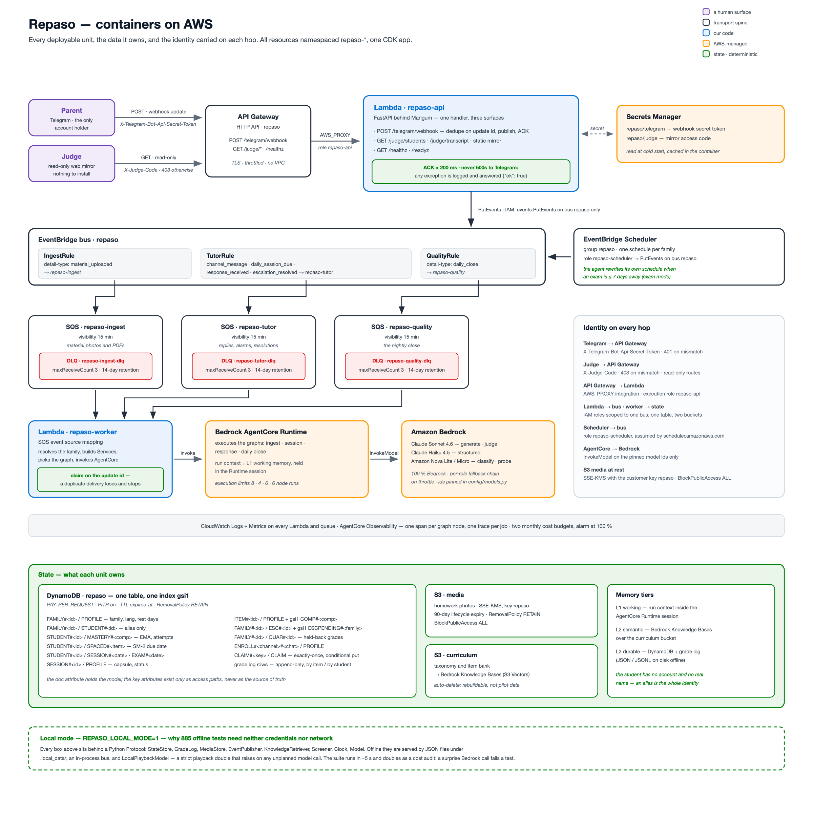

# Repaso

Repaso is a reinforcement tutor that a family runs from its own Telegram chat. The parent sends
whatever the school already sends home — a photo of the notebook, the weekly plan as a PDF, a
photocopied guide — and Repaso turns it into a short daily practice session for each child: a
two-sentence reminder and three questions, reviews first, one new thing a day. It is built for
households that cannot buy a private tutor, and for the operator or engineer who has to be able
to say exactly why a message was sent. The parent is the only account; the child has no login,
no profile and no name in the system. Product framing lives in
[docs/product/product-overview.md](docs/product/product-overview.md), the engineering tour in
[docs/product/how-it-works.md](docs/product/how-it-works.md).

## The interruption contract

The agent talks to a human only when there is a decision a human owns. Everything else — a
right answer, a wrong answer, a due review, a retired question — is handled silently.



Two interruptions carry a real decision, and both are visible end to end in
`scripts/run_demo_scenario.py`:

**A struggle escalation, with the evidence attached.** When a child's mastery state for one
competency is `STRUGGLING` on at least `escalation_min_samples` attempts (default 9) and the
cooldown since the last escalation has been spent (`DEFAULT_COOLDOWN_DAYS = 7`), the parent
gets the child's own answers as `EvidenceSpan` quotes, plus three options with their
trade-offs: a guided session tonight, a drafted note for the teacher, or a lighter week.
`compose_struggle` in `src/repaso/agents/escalation_composer.py` writes the wording; it never
decides whether to fire.

**A quarantine the parent settles with one tap.** When the grader's confidence on an open answer
falls below `grader_confidence_threshold` (default 0.85), no grade exists: the answer becomes a
`QuarantineItem` of kind `low_confidence_grade`, the parent sees the child's exact words and two
buttons, and mastery moves only once they tap. The same holding pen takes `injection_attempt` —
text that trips the deterministic screener is quarantined before any model sees it.

## Agents decide what and when; the harness computes how much

Every number in the pedagogy comes from code you can read, not from a model. The model is
never asked for an interval, a score, a threshold or a count.

| Quantity | Where it is computed | Rule |
| --- | --- | --- |
| Next review date | `core/harness/sm2.py` | SM-2: quality < 3 resets to a 1-day interval and adds a lapse; otherwise ease adjusts, first two intervals are 1 and 3 days, then `interval × ease` |
| Mastery | `core/harness/mastery.py` | Exponential moving average, `EMA_ALPHA = 0.3`, banded at 0.4 / 0.65 / 0.85 into struggling, developing, solid, mastered — `UNKNOWN` under 3 attempts |
| Struggle / silence / fast-guessing | `core/harness/escalation_triggers.py` | Level, attempt count and cooldown for struggle; trailing silent days over a window the daily close builds with rest days and holidays already masked; median latency under a quarter of the expected answer time for guessing |
| Item retirement | `core/harness/psychometrics.py` | Point-biserial discrimination against a floor of 0.15, over at least five observations |
| Legibility | `core/harness/legibility.py` | A Laplacian sharpness and contrast score a photo must clear before OCR is attempted at all |

The Adaptation Policy shows the split in one function. `decide()` computes a deterministic
`fallback_decision` from the measured signals, then asks the model. If the struggle or
disengagement trigger fired, the model's reply is discarded — a model opinion cannot veto an
interruption, and cannot manufacture one either. The model is only allowed to choose among the
pedagogical actions when no trigger has fired.

## The agent fleet

Thirteen agents across four Strands graphs, built per job with `GraphBuilder`. Deterministic
steps are nodes in the same graph as the model calls, and every graph sets an execution limit.



| Agent | Graph | Model role | What it decides |
| --- | --- | --- | --- |
| Material Parser | ingest | — | whether a page is legible enough to read at all |
| Intake Screener | ingest | classify | whether the material is safe to work from |
| Competency Mapper | ingest | structured | which curriculum competency the page teaches |
| Item Generator | ingest | generate | the questions drafted from the page |
| Item Critic | ingest | judge | which drafts are flawed enough to drop |
| Answerability Probe | ingest | probe | which items can be answered without the material, and so measure nothing |
| Session Planner | session | — | which due items and which new item make today's session |
| Capsule Composer | session | generate | the reminder that opens the session |
| Grader | response | judge | whether an open answer is right, and how sure it is — multiple choice is matched deterministically |
| Adaptation Policy | response | structured | what changes next, when no trigger has already decided |
| Escalation Composer | response, close | generate | the wording of an interruption and the drafted teacher note |
| Goal Verifier | close | — | which of the day's responses went unresolved |
| Item Optimizer | close | — | which items to retire on their measured discrimination |



Two pieces are unusual. The **Answerability Probe** answers a generated item *without* the
source material, and an item it gets right is dropped, because it was testing the options rather
than the child. The **cohort signal** node of the daily-close graph aggregates a section only
above a k-anonymity floor of three distinct families, and the note it has the Escalation
Composer draft is built from counts — no alias ever reaches that prompt.

## Model routing

`src/repaso/config/models.py` binds five roles to model ids, each with a fallback chain used
when the first choice throttles.

| Role | Default | Fallback |
| --- | --- | --- |
| generate | `us.anthropic.claude-sonnet-4-6` | Claude Haiku 4.5 |
| judge | `us.anthropic.claude-sonnet-4-6` | Claude Haiku 4.5 |
| structured | `us.anthropic.claude-haiku-4-5-20251001-v1:0` | Amazon Nova Lite |
| classify | `us.amazon.nova-lite-v1:0` | Amazon Nova Micro |
| probe | `us.amazon.nova-micro-v1:0` | Amazon Nova Lite |

Any role can be repointed without a code change: `model_for` reads `REPASO_MODEL_<ROLE>` off
the environment first, so `REPASO_MODEL_JUDGE=us.anthropic.claude-haiku-4-5-20251001-v1:0`
moves the grader alone. Every call goes through `model.structured_output(Schema, ...)` against
a strict Pydantic v2 model; no free text is parsed anywhere in the fleet.

## Architecture



Telegram webhook → API Gateway → Lambda (FastAPI through Mangum, acknowledging fast and never
returning 500 to Telegram) → EventBridge bus → SQS with a dead-letter queue → worker →
AgentCore Runtime executing the graphs. EventBridge Scheduler holds one alarm per family. State
is a single DynamoDB table with one overloaded key pair, mapped in
[docs/product/data-model.md](docs/product/data-model.md); media sits in a KMS-encrypted bucket.



Everything that touches AWS or the network is a Protocol in `src/repaso/tools/` with an on-disk
local implementation beside the cloud one, selected by `build_x(settings)`. The cloud
implementation is imported inside that function, so importing the offline suite never constructs
a boto3 client. The full diagram set is in [docs/media/README.md](docs/media/README.md).

## Quick start — entirely offline

No AWS account, no credentials, no network. `Settings.derive_local_mode` turns local mode on
whenever no region is configured, and in local mode `build_model` returns a playback model that
raises on any unplanned call, so the offline suite is also a cost audit.

```bash
python3.12 -m venv .venv && source .venv/bin/activate
pip install -e ".[dev]"
pytest
```

1,098 tests pass and 57 skip: the 56 live-tier tests, which need an explicit opt-in, and the
CDK synthesis module, which needs the `deploy` extra.

```bash
python scripts/run_demo_clock.py --days 14 --seed 20260901 --data-dir .local_data/demo_clock
```

Thirty simulated students through fourteen days of the real graphs — 420 sessions delivered
and 1,062 responses graded on this seed — then a nine-row ledger of expected against actual:
that struggle triage reached every low-ability student and nobody else, that the engagement
alert reached every disengaged student and no active one, that the cohort signal fired only for
the clustered section and at most once a week, that both planted prompt injections were
intercepted, that all five hedged open answers quarantined instead of being auto-graded, and
that the fast-guess switch fired for exactly the two fast guessers. The script exits 1 if any
row disagrees. Seed 20260901 is the calibration seed and is in-sample: it demonstrates that the
machine fires as designed, it does not measure how well it fires. Held-out seeds and the rules
governing them are in [scripts/README.md](scripts/README.md).

```bash
python scripts/run_demo_scenario.py --data-dir .local_data/demo_scenario
```

One family's whole first day, printed as the chat they would have had: an unknown chat sending an
invite code, consent, an alias the guard sends back because it looks like a real name, the
notebook photo, the eight questions written from it and the five the critic and the probe drop,
the capsule, three answers each followed by the harness reading on its own line — mastery EMA,
next review interval, the policy's decision, escalations open — the answer the grader would not
sign and the parent's one tap that settles it, and a photocopied guide whose worked example says
2/3 = 4/9, from which every generated question is rejected and nothing reaches the child. Then
the cost line and an eighteen-row ledger; it too exits 1 on any disagreement. Every message goes
through `handle_channel_message` and the runtime handlers, so what runs is the runtime.

```bash
python scripts/command_center.py --data-dir .local_data/demo_clock --tail 25
```

Replays a run's `telemetry.jsonl` as stage completions, model calls by role and failures. The
fourteen-day calibration run above reports 444 generate calls, 316 judge calls and 1,062
structured calls, and zero failures.

## Recording and replaying the model layer

Between the playback model and a live Bedrock call sits a cassette: one JSON line per model call
holding the role, the kind, the output model name, the payload the schema validated, and the
usage the call reported.

- **Record.** Deployed mode with `REPASO_RECORD_CASSETTE_PATH=<file.jsonl>` wraps each
  `BedrockModel` in a `RecordingModel`, which writes every stream and every structured output
  through as it passes, along with the token usage the Converse stream reported.
- **Replay.** Local mode with `REPASO_CASSETTE_PATH=<file.jsonl>` builds a `CassetteModel`,
  which serves the entries recorded for that role in order. The run is byte-identical and costs
  nothing.
- **Exhaustion is an outcome, not an invention.** A cassette that runs out stops the run with an
  explicit error rather than fabricating an answer, and a spent cassette is reported as a spent
  cassette rather than as a model failure. `run_demo_scenario.py` asserts that its cassette is
  played to the last entry and no further.

The scenario cassette, `src/repaso/simulator/cassettes/demo_fracciones.jsonl`, is authored
rather than recorded, and the script says so out loud above its cost line: 22,026 input and
5,966 output tokens over 32 of 32 calls, the numbers the cassette declares. A cassette whose
entries carry no usage prints `not recorded` rather than a number nobody measured.

## The live tier

`tests/live/` holds the only tests that call Amazon Bedrock. They are skipped by default and
answer what the offline suite cannot: does each model the fleet is configured to use actually
answer, and does it fill the exact schema the agent asks for, every time.

```bash
REPASO_LIVE_TESTS=1 REPASO_AWS_REGION=us-east-1 pytest tests/live
```

Both variables are required, and the skip message names whichever is missing. Before the first
call the run prices itself from `src/repaso/config/pricing.py` — schemas × samples × a
deliberately generous token allowance, at the on-demand rate for the model each role is bound to
— and refuses to start if the estimate exceeds `REPASO_LIVE_BUDGET_USD` (default $2.00).
`REPASO_LIVE_SAMPLES` (default 5) sets how many times each schema is asked for. Every test here
also carries the `live` marker, so `pytest -m "not live"` excludes the tier outright.

The run writes `.local_data/live/conformance-<timestamp>.json` and prints a table: per role and
schema, calls against successful parses, input and output tokens and dollars computed from
reported usage, then p50 and p95 latency per role. The conformance bar is 100 %, not a threshold
— a schema that parses four times in five is a schema production drops one call in five. Calls
are never retried, because a retry would repair exactly the failure this tier exists to find.
How the prices were sourced is in [tests/live/README.md](tests/live/README.md).

## Deployment

Six CDK stacks, every resource named or prefixed `repaso` and tagged `project=repaso`:
`repaso-foundation` (KMS key, media and curriculum buckets, the DynamoDB table and its index,
secrets, budget alarms), `repaso-messaging` (event bus, queues and dead-letter queues, routing
rules, scheduler group), `repaso-guardrails`, `repaso-api` (three Lambda functions and the HTTP
API), `repaso-agentcore`, and `repaso-observability` (alert topic, alarms, dashboard).

```bash
pip install -e ".[deploy]"
cd infra
python app.py
```

That writes every template to `infra/cdk.out`, with no credentials and no Docker daemon;
`tests/infra/test_synth.py` runs the same synthesis and asserts against the result.

```bash
cd infra
AWS_PROFILE=quanta npx cdk deploy --all -c alert_email=<your-alerts-email>
```

`repaso-agentcore` builds an ARM64 image from `deploy/agentcore/Dockerfile` as a CDK
`DockerImageAsset` and needs Docker running; the other five do not. The runtime serves
`/invocations` and `/ping` through `BedrockAgentCoreApp`, and its ARN lands in SSM at
`/repaso/agentcore/runtime-arn`. The execution role is assembled from the JSON in
`deploy/agentcore/iam/` with live references to the other stacks substituted in, so a renamed
bucket cannot drift out of the policy. `scripts/infra_toggle.py off` stops all scheduled
activity and event routing without deleting data. See [infra/README.md](infra/README.md) and
[deploy/agentcore/README.md](deploy/agentcore/README.md).

`repaso-guardrails` publishes a Bedrock guardrail: high-strength filters on five harm categories
and on prompt attack, anonymization of names, phone numbers, email addresses, addresses and ages,
and refusal messages written for a child to read. It applies at the model call itself, not only
at intake — `build_model` attaches it to every `BedrockModel` it constructs.

## Cost posture

Routing is the first control: the two cheap roles, classify and probe, run on Nova Micro and
Nova Lite, and only generation and judging reach a Sonnet-class model. `REPASO_MODEL_<ROLE>`
lets any role be moved down a tier under pressure without touching code.

Bounded work is the second. The daily close runs its rework under a `BoundedAttempts` budget of
two, and item regeneration draws from the same budget, so a bad night cannot spiral into an
open-ended spend. The two expensive ingest stages, generation and validation, are claimed
before they run, so a retried invocation resumes without repaying for either.
`core/harness/budgets.py` also carries a per-day call budget and a circuit breaker with their
own tests; neither is wired into a graph yet.

Accounting is the third. Every model is wrapped in an `InstrumentedModel` that traces role, call
kind, output schema, status and duration to the telemetry sink; `config/pricing.py` carries one
on-demand rate per model id the fleet can reach, and a test asserts that every configured model
has a price and no unused model has one, so adding a model fails the offline suite until its
rate is recorded. Offline runs cost nothing by construction: no model client is ever built.

## Status

**Offline, today.** The whole pipeline runs with no network and no credentials — enrolment,
consent, material ingest with OCR, generation, criticism, the answerability probe, the daily
session, grading, the harness, quarantines, escalations, the daily close, the cohort signal and
item retirement — through the same graphs and the same runtime handlers the deployment uses.
`pytest` is green; `scripts/run_demo_clock.py` and `scripts/run_demo_scenario.py` both check
their own ledgers and exit non-zero when a row disagrees.

**What the benchmarks measure.** `scripts/` holds the harness that produces every quantified
claim: a seed sweep over held-out seeds with pooled precision and recall and Wilson intervals, a
ground-truth re-scoring of every struggle fire against the simulator's latent ability, 1-D
sensitivity sweeps over the shipped thresholds, an adversarial bench, and a school-calendar
bench that separates genuine disengagement from weekends and holidays. Seeds are blocked and
gates frozen before the run; the rules for both are in [scripts/README.md](scripts/README.md).
Reproducing a number means running the script named there, and a claim with no script behind it
does not belong in this repository.

**Live models.** The infrastructure is deployable and the live conformance tier is written, but
it is opt-in and off by default, and no live measurement is asserted here yet. Latency, schema
conformance and measured spend per role are published as they are recorded.

## License

MIT — see [LICENSE](LICENSE).
