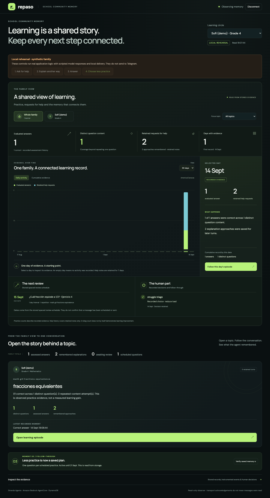

# Judge Repaso in five minutes

**Repaso - School Community Memory** connects a family's Telegram practice to a learning record an adult can inspect. The proposed **Good Neighbor Agents** audience is a community facilitator supporting families between meetings. The demonstration focuses on continuity: a request for another explanation retrieves the approach already tried, changes the example and leaves usable memory.

The project uses the Strands Agents SDK and a deployed Amazon Bedrock AgentCore Runtime. Two related upstream Strands bug-fix PRs were submitted with regression tests: [model telemetry](https://github.com/strands-agents/harness-sdk/pull/4207) and [custom model streaming compatibility](https://github.com/strands-agents/harness-sdk/pull/4208). Both were open, not merged, when verified on September 14, 2026; see [contribution evidence](upstream-contributions.md).

## Open the public demo

**[Launch School Community Memory](https://mwn2zjxcm2sz7jtrpj3y6ttblq0svgru.lambda-url.us-east-1.on.aws/judge/memory/)**, code **`REPASO-LIVE`**. Follow the four numbered controls, inspect the linked learning episode, and use **Reset demo** to start again. No installation is needed.

This AWS-hosted path runs the same synthetic rehearsal described below: scripted model replies, local delivery and an advanced clock. Browser sessions are isolated; cold starts or cache eviction can reset temporary state. It sends no Telegram messages and reads no production records.

## Choose an evidence path

| Path | What you can inspect | Boundary |
| --- | --- | --- |
| Hosted or local School Community Memory rehearsal | Family dashboard, three-column episode, retained approaches, answer and adult follow-through | Scripted model replies, isolated local state and delivery, controlled clock |
| Local seven-stage judge journey | Ingestion, practice, uncertain-answer review, teacher note versus reduced workload | Recorded Bedrock outputs for day one; authored later days |
| Dated live Telegram record | Two successful explanations, prior-context retrieval and AWS delivery evidence on AgentCore v13 | Developer-operated technical trial, not a family pilot or learning-gain evaluation |

The local URLs below are loopback addresses, not public judge URLs. Public repository, video and hosted-access status belong in the [release checklist](release-checklist.md).

## Install once

Python 3.12 or newer is required. No AWS account, Telegram token or Docker is needed for either local demonstration.

```bash
git clone https://github.com/CarSanoja/repaso.git
cd repaso
python3.12 -m venv .venv
source .venv/bin/activate
pip install -c requirements.lock -e ".[dev]"
```

Use a Python interpreter that satisfies the version requirement; for example, `python3.13` can replace `python3.12`.

## The five-minute product route

```bash
python scripts/run_memory_observer.py --rehearsal --port 8870
```

Open **http://127.0.0.1:8870/judge/memory/** and enter **`REPASO-VIEW`**.

1. **0:00-0:45 - A family, a topic, an evidence trail.** Inspect the family dashboard. Its daily and cumulative views describe recorded activity, with empty history labeled honestly. Select the learner and fractions topic.
2. **0:45-1:30 - Ask for help.** Use **1. Ask for help**, then **Open learning episode**. The three columns show retained conversation, recorded agent/memory activity and topic evidence.
3. **1:30-2:30 - Ask again.** Use **2. Explain another way**. The next turn retrieves one prior approach, saves another and presents both in the memory comparison. The assessed-answer count remains zero: asking for help is not a wrong answer.
4. **2:30-3:15 - Look for learning evidence.** Use **3. Answer**. An actual assessed result appears. Distinct content and difficulty coverage are separate from raw attempt count. A stored mastery estimate is not presented as proof of improvement.
5. **3:15-4:15 - Make a human decision matter.** Use **4. Choose less practice**. Under **Inspect the evidence → Decisions / Practice**, inspect the resolved choice, saved adaptation and next practice with one question. This step explicitly advances the rehearsal clock.
6. **4:15-5:00 - Reopen the evidence.** Return to **Family dashboard**, select the recorded day and follow its episode. Replay moves through stored turns; the right column still labels current topic totals. **Verify saved memory** reads storage again.

The server uses temporary local state and resets when stopped. Controls do not send Telegram messages or call a paid model. The [episode runbook](episode-demo-runbook.md) explains reconstruction, retention, event links and the recording sequence.



*Verified local rehearsal screenshot, including a controlled next-day clock. This is not a school deployment screenshot.*

## Compare the two adult interventions

The separate judge journey provides a compact, reproducible comparison:

```bash
python scripts/run_judge_demo.py
```

Open **http://127.0.0.1:8766/judge/**, code **`REPASO-DEMO`**. Run **a note for the teacher**, then **less practice tomorrow**, and compare the final stage. One choice retains a three-question plan; the other reduces it to one question. The teacher note is drafted for the parent to review and forward, not automatically sent to a teacher.

For machine-readable checkpoints, choose new empty output directories:

```bash
python scripts/run_demo_scenario.py --data-dir .local_data/judge-note --decision teacher_note --report .local_data/judge-note.json
python scripts/run_demo_scenario.py --data-dir .local_data/judge-light --decision reduce_load --report .local_data/judge-light.json
```

The teacher-note and reduced-load scenarios contain 24 and 23 checks respectively. They execute application orchestration with recorded/authored model outputs. The cassette's printed model cost is the cost of recording it, not a charge or price for replaying the scenario.

## What was verified live

On September 14, a developer-operated Telegram exchange used **AgentCore runtime version 13**. Repaso first explained equivalent fractions with a cake example. When asked again, it loaded the prior approach, produced a paper-folding explanation and stored it. Correlated AWS records connected retrieval, successful generation, saved memory and transport acknowledgements.

The live observer showed **three assessed answers, one distinct assessed question, three retained help requests and two successful retained explanation approaches**. One earlier help request failed and remains visible without being counted as a successful explanation. The existing three answers repeated the same content; there is only one day of real activity. Those facts demonstrate working adaptation and traceability, not improved learning.

Read [the dated live check](memory-live-check-2026-09-14.md) for the recorded failures and fixes. The adult-decision-to-next-practice scene has its own local evidence; it is not validated by the two live explanations. The observer reconstructs retained records, not a complete Telegram archive, and an acknowledgement is not a read receipt.

## Inspect the implementation

- [Architecture diagram](../media/architecture.svg) and [runtime guide](../../deploy/agentcore/README.md): queued transport into AgentCore, four Strands graphs, typed model calls and persistent application memory.
- [Ingestion](../../src/repaso/core/orchestration/ingest_graph.py), [practice](../../src/repaso/core/orchestration/tutor_graph.py), [responses](../../src/repaso/core/orchestration/response_graph.py), [daily quality](../../src/repaso/core/orchestration/quality_graph.py): the four executable graphs.
- [Episode projection](../../src/repaso/api/memory_episodes.py): verified record/event linkage, explicit transcript gaps and retained assessments.
- [Evolution projection](../../src/repaso/api/memory_evolution.py): effective assessment history, timezone boundaries, learner isolation and retention-limited help history.
- [Evidence register](../evidence/README.md), [evaluation protocol](../../evaluation/README.md) and [security posture](../security/README.md): measured results and their limits.

```bash
REPASO_LOCAL_MODE=true pytest -q
ruff check .
node --check src/repaso/api/static/memory.js
python scripts/check_repo_hygiene.py
```

The Node command is an optional frontend syntax check. Install `.[dev,deploy,runtime]` to include the infrastructure and runtime dependencies. Live tests remain opt-in; ordinary tests substitute external services or model replies. Dated test and browser results are recorded in the [episode runbook](episode-demo-runbook.md), rather than a permanent assertion that every future checkout has the same count.

## What the project does not claim

No independent teacher grading evaluation, family pilot, school partnership or measured educational benefit is claimed. The supported enrollment path is one learner per family, fourth-grade mathematics and supported printed Spanish material. The observer can separate multiple stored learner records; that does not imply a deployed school roster integration. This is application learning memory in DynamoDB, not the separate AgentCore Memory service.
